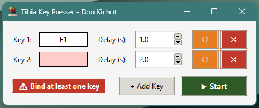
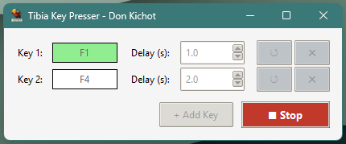

# Tibia Key Presser

A simple tool that automatically presses keys in Tibia for you. Perfect for repetitive actions like healing, mana regeneration, using runes, or any hotkey-based automation.

**Works in the background** - you can browse the web, watch videos, or do other things while it sends keys to Tibia.

<p align="center">
  
  
</p>

---

## What It Does

| Feature | Description |
|---------|-------------|
| **Background operation** | Sends keys to Tibia even when the game window is minimized or unfocused |
| **Multiple keys** | Configure up to 8 different keys, each with its own delay |
| **Independent timers** | Each key runs on its own schedule - they don't wait for each other |
| **Character detection** | Automatically finds your Tibia window and shows character name in the app title |
| **Visual feedback** | Color-coded indicators show exactly what's happening |

---

## Visual Feedback Guide

The app uses colors and messages to keep you informed:

### Input Field Colors

| Color | Meaning |
|-------|---------|
| ⬜ **White** | Ready - waiting for you to click and bind a key |
| 🟡 **Yellow (pulsing)** | Listening - press any key now to bind it |
| 🟢 **Green (flash)** | Active - key was just sent to Tibia |
| 🔴 **Red** | Error - you need to bind a key before starting |

### Status Messages

Messages appear at the bottom left of the window:

- `⌨ Press a key to bind...` - Click detected, now press your desired key
- `⚠ Bind at least one key` - You tried to start without any keys configured

---

## Requirements

- **Windows 10 or Windows 11**
- **Tibia client** must be running and logged in
- No installation needed if using the .exe file

---

## Quick Start (For Regular Users)

### Step 1: Download
Download `tibia_key_presser.exe` from the [`dist`](dist/) folder.

### Step 2: Prepare Tibia
Open Tibia and log into your character. The game can be minimized or in the background.

### Step 3: Launch the App
Run `tibia_key_presser.exe`. If Tibia is detected, your character name appears in the window title:
> `Tibia Key Presser - YourCharacterName`

### Step 4: Configure Keys
1. Click on the **Key** input field (it will start pulsing yellow)
2. Press the key you want to automate (e.g., F1 for healing)
3. Set the **Delay** - how many seconds between each key press
4. Click **+ Add Key** to add more keys (up to 8 total)

### Step 5: Start
Click the green **▶ Start** button. You'll see green flashes on each key as it's being pressed.

### Step 6: Stop
Click the red **■ Stop** button when you're done.

---

## Tips for Best Results

- **Set appropriate delays** - Too fast might get you flagged, too slow might not be effective
- **Test with Tibia in focus first** - Make sure your hotkeys work in-game before automating
- **Use F-keys** - F1-F12 are commonly used for Tibia hotkeys
- **One instance only** - Don't run multiple copies of the app

---

## For Developers

### Prerequisites
- Python 3.12 or newer
- pip (Python package manager)

### Installation

```bash
git clone https://github.com/SkorczanFFF/tibia-key-presser.git
cd tibia-key-presser
pip install -r requirements.txt
```

### Run from Source

```bash
python -m src.main
```

### Build Executable

```bash
pip install pyinstaller
python -m PyInstaller tibia_key_presser.spec --clean
```

Output: `dist/tibia_key_presser.exe`

### Dependencies

| Package | Purpose |
|---------|---------|
| `pywinauto` | Window detection and sending keystrokes |

---

## Project Structure

```
tibia-key-presser/
├── src/
│   ├── main.py                 # Application entry point
│   ├── ui/
│   │   ├── app_window.py       # Main window and controls
│   │   └── components/
│   │       └── key_entry.py    # Individual key-delay row component
│   ├── core/
│   │   ├── key_presser.py      # Threaded key pressing logic
│   │   └── window_manager.py   # Tibia window detection and communication
│   └── utils/
│       ├── constants.py        # App settings (max keys, intervals)
│       └── paths.py            # Icon/resource path resolution
├── icons/
│   ├── tkp_icon.ico            # Windows executable icon
│   └── tkp_icon.png            # Application window icon
├── screens/                    # Screenshots for documentation
├── dist/                       # Compiled executable
├── requirements.txt            # Python dependencies
├── tibia_key_presser.spec      # PyInstaller build configuration
└── readme.md
```

---

## Troubleshooting

| Problem | Solution |
|---------|----------|
| **Character name not showing** | Make sure Tibia is running and you're logged in |
| **Keys not being sent** | Check if Tibia window title starts with "Tibia - " |
| **App won't start** | Run as Administrator, or check Windows Defender isn't blocking it |
| **Green flash but no effect in game** | Verify the hotkey is correctly configured in Tibia's settings |

---

## Technical Details

- Uses Windows API via `pywinauto` to send keystrokes
- Window detection uses regex pattern: `^Tibia - .*`
- Each key runs in a separate daemon thread
- Delays are broken into 100ms intervals for responsive stopping
- Keys are sent using `send_keystrokes()` method

---

## Good to Know

- ✅ Works with Tibia minimized or in background
- ✅ Each key has independent timing
- ✅ Stops immediately when you click Stop
- ⚠️ Windows only (uses Windows-specific APIs)
- ⚠️ Tibia must be running before starting the bot
- ⚠️ No delay randomization - timing is consistent

---

## License

**MIT License** - free to use, modify, and distribute.

---

## Links

- 📁 [GitHub Repository](https://github.com/SkorczanFFF/tibia-key-presser)
- 📥 [Download Executable](https://github.com/SkorczanFFF/tibia-key-presser/tree/master/dist)
